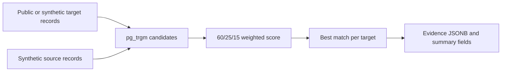

# Pairwell

**PostgreSQL fuzzy matching for public filing data.**

[](https://github.com/dallascrilley/pairwell/actions/workflows/ci.yml)
[](LICENSE)

I extracted these two SQL files from a production employer-enrichment system. This repository contains public and synthetic data only. The source history, dashboard, and client CSVs stay private.

Pairwell links employer records to a second dataset with a weighted confidence score: 60% fuzzy name similarity, 25% exact city match, and 15% fuzzy address similarity. It keeps one best match per employer, records the scoring evidence as JSONB, and refreshes denormalized summary fields.

## Reproduce the 21,875-record run

The demo downloads 21,875 filing records from the Texas Department of Insurance's public [Workers' compensation non-subscriber employer information](https://data.texas.gov/d/azae-8krr) dataset. It loads 200 target companies, derives 20 synthetic permit records with modified names, and runs the production matcher against them.
Prerequisites: Node.js 22 or newer, Docker with a running daemon, and outbound
network access to `data.texas.gov`.

```bash
./scripts/demo.sh
```

Abridged expected result:

```text
public_filing_records
---------------------
                21875

accepted_matches
----------------
              20

company_name                                  city       synthetic_permit  match_confidence  synthetic_receipts
Angels On The Highway Mobile Grooming Llc     Princeton  SYNTH-0014                    0.91          170000.00
American Ecology Environmental Services Corp  Tyler      SYNTH-0013                    0.90          165000.00
```

The release brief referenced 21,875 filing records. The live endpoint reported 106,898 rows and 17,422 distinct filing IDs on 2026-08-12. The demo therefore selects a deterministic 21,875-row sample ordered by filing ID, record type, and company name. It does not present 21,875 as the current endpoint total.

The target rows come from the public Texas dataset. Permit numbers and receipt amounts are generated inside the disposable demo database and have no production meaning.

## How it works



| File | Role |
|---|---|
| `sql/001_enrichment_schema.sql` | Registry, junction table, weighted matcher, and standard refresh |
| `sql/002_optimized_matching.sql` | Trigram indexes, selective candidates, and bounded batch refresh |
| `tests/000_bootstrap.sql` | Minimal schema that replaces the private production tables |
| `tests/010_fixtures.sql` | Synthetic match and non-match cases |
| `tests/020_assertions.sql` | Best-match, threshold, idempotency, batch, and summary assertions |

The two files under `sql/` are byte-identical to the extracted source at commit `6eef22d`. All public scaffolding lives outside those files.

## Test from a clean machine

Prerequisites:

- Node.js 22 or newer
- Docker with a running daemon

Run:

```bash
./scripts/test.sh
```

The script starts a disposable PostgreSQL 17 container, runs the Node downloader tests, applies both SQL files, loads synthetic fixtures, executes behavior assertions, and removes the container. Tests do not call the Texas API.

## Boundaries

- The matching weights are fixed heuristics, not learned probabilities.
- One best permit match is retained per company and source.
- The demo's receipt values are synthetic.
- The live Texas endpoint can change after this repository's verification date.
- The SQL uses PostgreSQL-specific `pg_trgm`, JSONB, and PL/pgSQL features.

## License

MIT. Copyright (c) 2026 Dallas Crilley.
